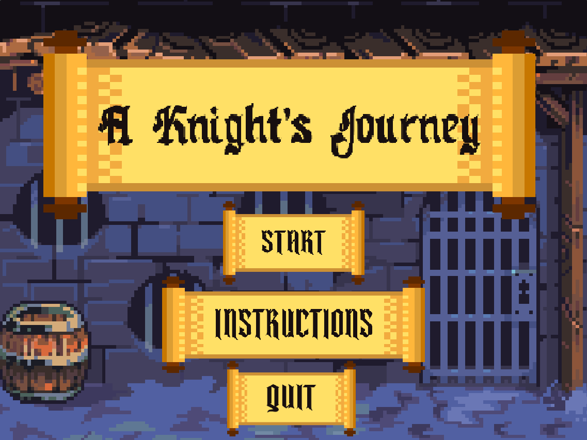

# A Knight's Journey 

 

_A mini-game with 3 levels where you embark on an epic quest as a brave knight!_

## Overview

"A Knight's Journey" was first developed using Scratch as part of a collaborative project with a group of enthusiastic computer scientists. With the desire to make it accessible on more platforms, I've ported it to both HTML for web browsers and a Windows executable (32-bit) for desktop users.

In this game, you'll guide your knight through a series of challenges spread across 3 different levels. Whether you're facing enemies, avoiding traps, or flying through caverns, each level offers a unique experience that will test your skills and bravery.

  

## Platforms

- **Windows (32-bit executable)**
- **HTML (Browser-based)**

## Installation and Launch Instructions

### Windows Users
1. Download the latest release of `A_Knight's_Journey.exe` from the provided link.
2. Run the executable by double-clicking the file.
3. **Important**: The game is not signed, so Windows SmartScreen may give you a warning when you try to run the program. If this happens:
   - Click **"More Info"**.
   - Then click **"Run Anyway"** to proceed with the installation.
4. Follow the installer instructions:
   - Accept the terms and conditions.
   - Choose your installation directory (or leave it as the default).
   - Once the installation is complete, the game will launch automatically.
5. If the game doesn't start, simply find "A Knight's Journey" in your start menu or desktop and run it.

### HTML (Browser-based)
1. Download the latest release of `A_Knight's_Journey.html` from the provided link.
2. Open the file using any modern web browser (Google Chrome, Firefox, Microsoft Edge, etc.).
3. The game will launch directly in your browser for a more lightweight experience, with no installation required.

## Gameplay

- **Level 1: Dungeon**
  - Fight off bats with your mighty sword as they fly towards you from all directions!
  
- **Level 2: Icicle Cave**
  - Jump over icy spikes while exploring a vast Icicle Cave, reach the end and escape!

- **Level 3: The Dragon's Lair**
  - Face the ultimate challenge as you enter the dragon's lair. Ride the dragon out to complete your knight's journey!

## Controls

- **WASD**: Move your character.
- **Right click**: Shoot at enemies.
- **Spacebar**: Jump or fly to manuever around incoming obstacles.

## Credits

- **[Original Scratch Version](https://scratch.mit.edu/projects/832653301/)**: _Developed by Darrel Loh De Jun, YM Tunku Ines Najihah Raden, Anjelie Kandasamy, Sze Huey Ong, Asif Ahamed Siddique, Yu Qing Ti and Yi Xin Yeo._
- **HTML and Windows Port**: _Darrel Loh De Jun via TurboWarp Packager._
